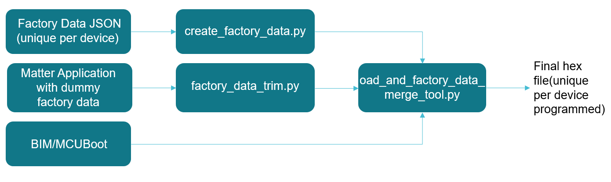
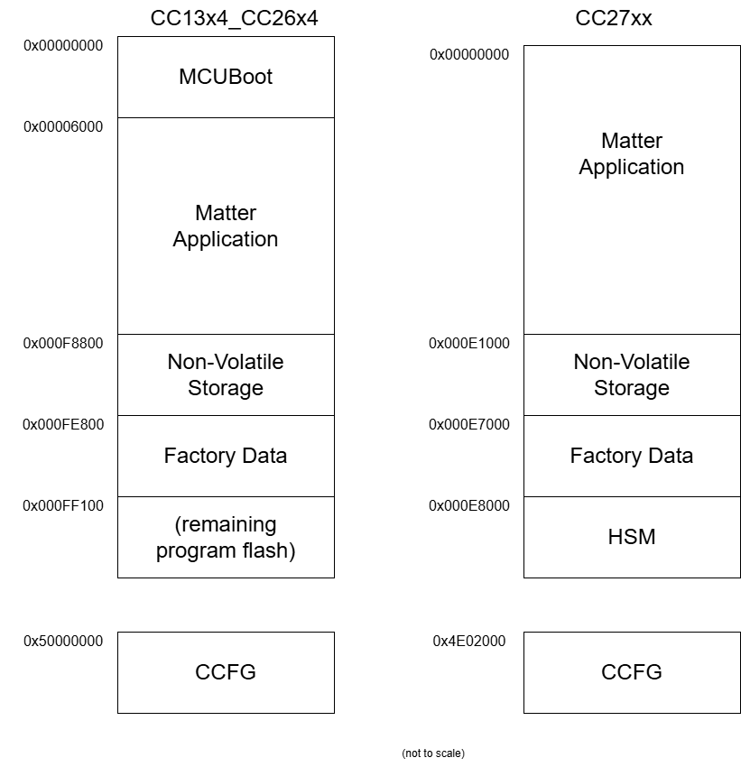

# Texas Instruments Matter Factory Data Programming User Guide

This document describes how to use the factory data programming feature for
Matter example applications from Texas Instruments.

## Background

The Matter specification lists various information elements that are programmed
at the factory. These values do not change and some are unique per device. This
feature enables customers developing Matter products on TI devices to program
this data and use this as a starting point towards developing their factory
programming infrastructure for their Matter devices.

## Solution Overview:

TI Matter examples allow the use of factory data in the following two ways:

-   **Example Out of Box Factory Data** : Use TI example DAC values to get
    started. This is intended to be used during development.
-   **Custom factory data** : Allows users to configure custom factory data via
    a JSON file. The custom values are then processed by a script provided by TI
    and merged with the Matter application to create a binary that can be
    flashed on to devices.

### Solution Block Diagram



Each element is described in more detail below:

1. Factory Data JSON: This file is located at src/platform/cc13xx_26xx.
   Developers can configure this per device. Elements in this file are from the
   specification.
2. Matter Application with dummy factory data: Any TI Matter example application
3. MCUboot: MCUboot image used for OTA-enabled examples. This is built with the
   Matter application and does not require additional build steps from
   developers.
4. create_factory_data.py: Processes a factory data JSON file and generates a
   hex file with the unique factory data values configured in the JSON file.
5. factory_data_trim.py: When using the custom factory data option, this script
   removes the dummy factory data which is required to be able to successfully
   compile the application.
6. `oad_and_`\factory_data_merge_tool.py: Merges the factory data hex, Matter
   application without factory data and MCUboot image (if OTA-enabled) to
   generate a functional hex that can be programmed onto the device.

## Flash memory layout



## How to use

Out of box factory data location is configured to be on second to last page of
flash. For the CC27xx device, factory data is placed at the end of flash before
the HSM module. For CC13x4_CC26x4, the starting address is `0xFE800`, for
CC27xx, the starting address is `0xE7000`. Each can be configured in their
respective factory data linker command files (\*.lds), located
[here for CC13x4_CC26x4](../../../src/platform/cc13xx_26xx) or
[here for CC27xx](../../../src/platform/ti/cc27xx).

To configure (CC13X4_CC26X4 for reference):

1. Linker file: Set the start address for factory data in the linker file being
   used by the application

```
FLASH_FACTORY_DATA (R)  : ORIGIN = 0x000fe800, LENGTH = 0x00000900
```

```
/* Define base address for the DAC arrays and struct */
    PROVIDE (_factory_data_base_address =
        DEFINED(_factory_data_base_address) ? _factory_data_base_address : 0xFE800);
```

2. In the example's args.gni file, set 'custom_factory_data' to true

It is recommended to keep 2 dedicated pages for CC13x4_CC26x4/CC27xx for factory
data.

### Formatting certs and keys for JSON file

To format the DAC, private key and PAI as hex strings as shown in the Factory
Data JSON file, use the chip-cert tool located at src/tools/chip-cert and run
the _convert-cert_ command, and list -X, or X.509 DER hex encoded format, as the
output format. These strings can then be copied into the JSON file.

The SPAKE parameters should be converted from base-64 to hex as well before
being copied into the JSON file.

### Creating images

The example application can be built using the instructions in the example's
README. The factory data from the JSON file will be formatted into a hex file
that will then be merged into the final executable. The final executable will be
named _{example-application}-mcuboot.hex_ when OTA is enabled for CC13x4*CC26x4.
If OTA is disabled, the final executable will be named
*{example-application}-example-and-factory-data.hex*. The factory data that was
inputted into the JSON file will be named
*{example-application}-factory-data.hex\_.
