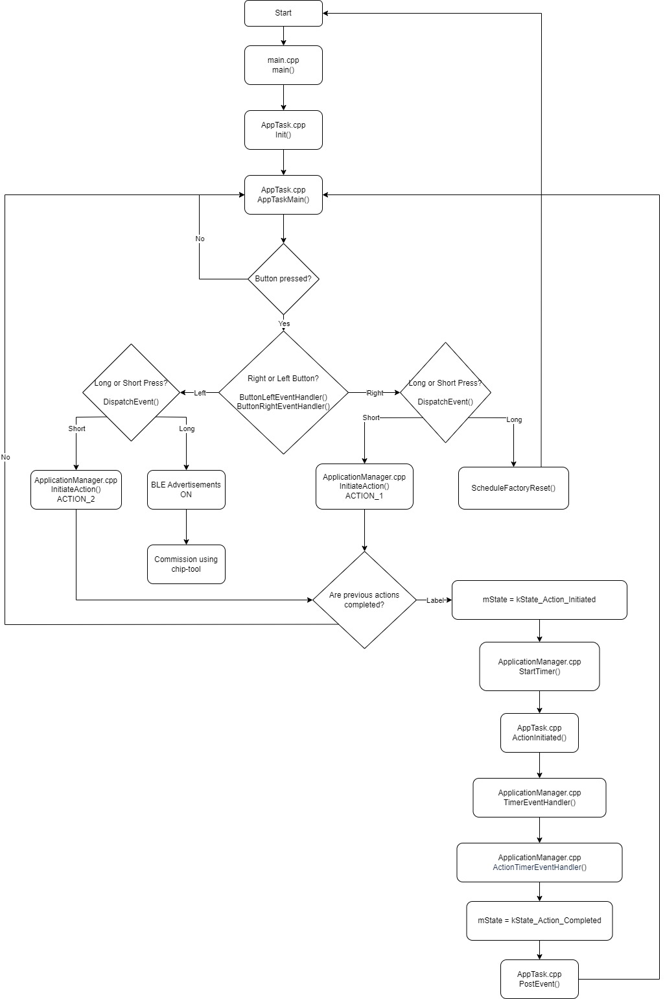

# Creating a Matter Application Using Generic-App

- [Creating a Matter Application Using Generic-App](#creating-a-matter-application-using-generic-app)
  - [Introduction](#introduction)
  - [Creating Your Application](#creating-your-application)
    - [Make a new directory](#make-a-new-directory)
    - [Initial Modifications](#initial-modifications)
    - [Generic-App Flow Chart](#generic-app-flow-chart)
    - [Modifying Source Code](#modifying-source-code)
    - [ZAP tool Cluster Configuration](#zap-tool-cluster-configuration)
    - [Building Your Application](#building-your-application)

---

## Introduction

Use this guide to help with the development of your custom Matter application.
Read the [README.md](cc13x4_26x4/README.md) file for more information about
generic-app's base functionalities.

## Creating Your Application

### Make a new directory

Copy and paste the generic-app folder in connectedhomeip/examples and rename the
folder to **new-app** (The name does not have to be new-app and can be anything
you choose. Make sure to make the following name changes accordingly). Also,
rename the folder **generic-common** to **new-common** and the files
**generic-app.zap** and **generic-app.matter** to **new-app.zap** and
**new-app.matter**.

### Initial Modifications

Before modifying the source code, apply these changes:

```gn
    # In connectedhomeip/examples/new-app/cc13x4_26x4/BUILD.gn

    # Change this line of code:
    project_dir = "${chip_root}/ti_examples/generic-app/cc13x4_26x4"
    # to this:
    project_dir = "${chip_root}/examples/new-app/cc13x4_26x4"


    # Change this line of code:
    public_configs = [ ":generic_app_config" ]
    # to this:
    public_configs = [ ":new_app_config" ]


    # Change this line of code:
    ti_simplelink_executable("generic_app") {
        output_name = "chip-${ti_simplelink_board}-generic-example.out"
    # to this:
    ti_simplelink_executable("new_app") {
        output_name = "chip-${ti_simplelink_board}-new-example.out"


    # Change this line of code:
    "${chip_root}/ti_examples/generic-app/generic-common",
    # to this:
    "${chip_root}/examples/new-app/new-common",


    # Change this line of code:
    deps = [ ":generic_app" ]
    # to this:
    deps = [ ":new_app" ]
```

```gn
    # In connectedhomeip/examples/new-app/new-common/BUILD.gn

    # Change this line of code:
    chip_data_model("generic-common") {
    # to this:
    chip_data_model("new-common") {


    # Change this line of code:
    zap_pregenerated_dir = "${chip_root}/zzz_generated/generic-app/zap-generated"
    # to this:
    zap_pregenerated_dir = "${chip_root}/zzz_generated/new-app/zap-generated"
```

### Generic-App Flow Chart

-   

### Modifying Source Code

-   The program starts in the main() function found in
    [new-app/cc13x4_26x4/src/main.cpp](cc13x4_26x4/src/main.cpp) but the
    application's general behaviour is defined in
    [AppTask.cpp](cc13x4_26x4/src/AppTask.cpp). In AppTask.cpp, AppTaskMain()
    waits for an event and then uses DispatchEvent() which process the event to
    be sent to the correct handler such as ButtonLeftEventHandler() or
    IdentifyStartHandler().

-   Editing what happens during a button click can be a good starting point for
    creating your application. Use the
    [lighting-app example](../lighting-app/cc13x4_26x4/src/AppTask.cpp) to see
    how the DispatchEvent() function handles a button click to toggle an LED
    on/off.

-   [ApplicationManager.cpp](../generic-app/cc13x4_26x4/src/ApplicationManager.cpp)
    will help you manage more application specific functionalities. For an
    example, the cluster fuctionality of the button presses from the previous
    step can be set in ActionTimerEventHandler(). Out of box, generic-app has
    the OnOff cluster implemented as a basic example to follow.

-   Matter commands (from CHIP-tool, other devices, and the device itself) reach
    the application through the function
    [MatterPostAttributeChangeCallback()](cc13x4_26x4/src/ZclCallbacks.cpp). Add
    to this function so that the commands can be forwarded to their
    corresponding functions. For an example, you can add this to be able to
    process commands from the Identify cluster:

    ```
    else if (clusterId == Identify::Id){

    }
    ```

-   If any new .cpp files were added to the [src](generic-app/cc13x4_26x4/src)
    directory don't forget to add them to the
    [BUILD.gn](generic-app/cc13x4_26x4/src/BUILD.gn) file here:
    ```
    sources = [
    "${chip_root}/examples/providers/DeviceInfoProviderImpl.cpp",
    "${project_dir}/src/AppTask.cpp",
    "${project_dir}/src/ZclCallbacks.cpp",
    "${project_dir}/src/main.cpp",
    ]
    ```
-   Binding functionality is included with the generic-app and can be turned
    on/off by the define "BINDING_ENABLED" found in
    [ApplicationManager.h](cc13x4_26x4/include/ApplicationManager.h). This
    feature allows matter devices on the same network to bind to each other and
    send cluster commands such as a light-switch devices binding to a lighting
    device.
-   If you know that you will not need the binding functionality, you can delete
    the files [BindingHandler.h](cc13x4_26x4/include/BindingHandler.h) and
    [BindingHandler.cpp](cc13x4_26x4/src/BindingHandler.cpp) and remove all the
    "#ifdef BINDING_ENABLED" sections from
    [ApplicationManager.cpp](cc13x4_26x4/include/ApplicationManager.cpp). Remove
    all includes to these files within the /src and /include directories as
    well.
-   The [generic-app.zap](cc13x4_26x4/generic-common/generic-app.zap) file's
    endpoint 0 will also have to be edited to disable the binding cluster in the
    "general" section of the zap file and the .matter file will have to be
    regenerated. The process of how to do this will be explained in the next
    section.

### ZAP tool Cluster Configuration

The latest compatible ZAP tool should have been installed as a third party tool
during the environment bootstrap process. This tool will be used to edit .ZAP
files which allows you to pick and choose what clusters/attributes your
application will support.

-   To run the ZAP tool

    ```
    $ cd ~/connectedhomeip
    $ source ./scripts/activate.sh
    $ zap
    ```

-   On the ZAP tool, open and choose the generic application .ZAP file found
    here (you may have changed its name to new-app.zap):
    [generic-app.zap](generic-common/generic-app.zap)

-   Once the file is open, you will see that there are already two endpoints
    setup in generic-app. Enpoint 0 is the Matter root node and Endpoint 1
    contains a Matter On/Off Light for the purpose of some generic functions.
-   Each functionality of your matter application should have its own endpoint.
    The mandatory clusters and attributes should be automatically set for the
    specific device chosen. Don't forget to save the file once you have
    configured your zap file.

-   The next step is to generate the .matter file from the .zap file you
    configured from the previous step.

    ```
    $ cd /connectedhomeip/scripts/tools/zap
    $ ./generate.py ti_examples/generic-app/generic-common/generic-app.zap

    ```

-   All other zap files will be generated during the build step. To learn more
    about code generation see this page:
    https://github.com/project-chip/connectedhomeip/blob/master/docs/code_generation.md

### Building Your Application

See the sections for **Compilation** and **Programming** in the
[README.md](cc13x4_26x4/README.md) to see how to compile, build, and flash your
application to a supported Texas Instruments device.
